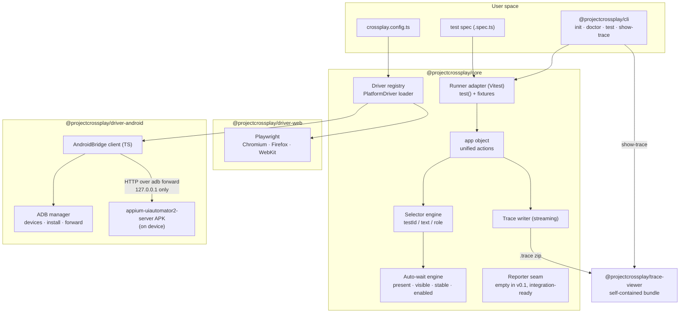

# Architecture

## Overview

**Pattern**: a modular monorepo with a plugin (driver) architecture. `PlatformDriver` is the one extension boundary — everything platform-neutral (selector resolution, auto-wait, tracing, error wording) lives in core and never changes when a driver is added. This is what makes an iOS or community driver possible without touching core; see [`driver-plugin.md`](driver-plugin.md).

## Components

| Package | Owns |
|---|---|
| `@projectcrossplay/core` | The `test`/`app` API, the `by.*` selector engine, the auto-wait engine, trace writing/reading, the driver registry, the reporter seam |
| `@projectcrossplay/driver-web` | Playwright-backed `PlatformDriver` for Chromium/Firefox/WebKit |
| `@projectcrossplay/driver-android` | UIAutomator2-backed `PlatformDriver` — no Appium server; a thin TypeScript client talks HTTP to the (reused) `appium-uiautomator2-server` APK over an adb port-forward |
| `@projectcrossplay/cli` | `init` / `doctor` / `test` / `show-trace` |
| `@projectcrossplay/trace-viewer` | The local trace viewer — a small, self-contained bundle with no external dependencies at runtime |

## Key decisions

**Test runner: Vitest.** CrossPlay's `test`/`expect` are a thin fixture layer on top of Vitest rather than a bespoke runner — Vitest already solves parallelism, watch mode, and reporter plumbing well; core only needs to own the `app` fixture's lifecycle (launch → hand to the test body → dispose, on pass, fail, or crash).

**Android bridge: reuse `appium-uiautomator2-server`, skip the Appium server.** The APK that backs Appium's UiAutomator2 driver is a solid, maintained piece of on-device automation infrastructure — CrossPlay installs and drives it directly over HTTP via an adb port-forward, with its own thin TypeScript client, instead of running a full Appium server as a middle layer. This keeps the dependency footprint small and the protocol surface (session create → find → act → dispose) fully owned and documented rather than hidden behind another framework.

**Trace format: custom, minimal, documented.** A `.trace` file is a zip: a manifest, a `steps.jsonl` action log, and per-step screenshots/hierarchy dumps. It's deliberately simple enough to read without tooling, and it's treated as **untrusted input** by both the CLI and the viewer — a trace someone hands you (e.g. in a bug report) is never eval'd or otherwise trusted; the viewer parses it defensively and fails into an empty state on anything malformed.

**Trace viewer: self-contained, no CDN.** `crossplay show-trace` serves the viewer from `127.0.0.1` on an ephemeral port behind a path token, with a strict CSP. It never phones out.

## Auto-wait

Every `app` action (`tap`, `fill`, `getText`, `waitFor`) runs the same core-owned wait loop before touching the driver: poll with adaptive backoff until the target element is **present → visible → stable → enabled**, or the configured timeout elapses. Drivers implement none of this — `findElements`/`getElementState` return the current state immediately and core decides when to retry. That's a deliberate contract rule (see [`driver-plugin.md`](driver-plugin.md)): if a driver waited internally, timing behavior would drift between platforms, which is exactly what a unified API is supposed to prevent.

## Security model

| Concern | How it's handled |
|---|---|
| Supply chain | Small runtime dependency tree; CI fails on high/critical audit advisories; npm publish uses provenance |
| Local network exposure | Every local server/forward (viewer, adb forward) binds `127.0.0.1` only |
| Secrets in traces | `fill()` masks its value in the trace by default; pass `{ mask: false }` to opt a field out |
| Untrusted trace files | The viewer parses traces defensively — no `eval`, no raw HTML injection, strict format validation |
| Config trust | `crossplay.config.ts` is user-authored code, same trust level as the test spec itself — it is validated for shape, not sandboxed |

Full disclosure process: [`SECURITY.md`](../SECURITY.md).

## Non-functional targets

| Target | Approach |
|---|---|
| Zero flakes across repeated runs | One core-owned wait engine (no per-driver timing logic to drift); verified with a nightly flake farm |
| Fast session startup | Warm server reuse within a run; the UIA2 server APKs install once per device, not per session |
| ≤15-minute onboarding | `doctor` diagnoses your environment and prints the exact fix for each gap; the quickstart is that same CLI flow, verbatim |
| No unbounded resource growth | Deterministic dispose paths on every exit path (pass, fail, crash); a streaming trace writer (nothing accumulates in memory); a nightly soak test asserts bounded heap growth over repeated launch/dispose cycles |
